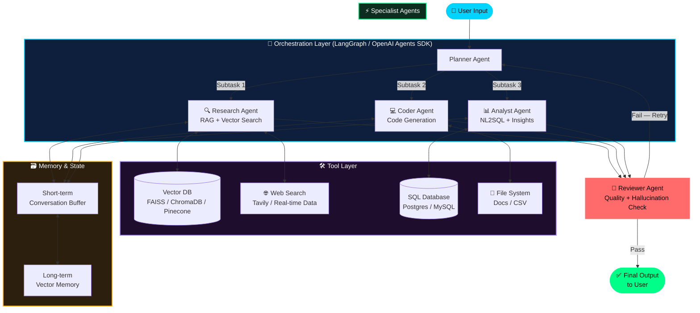

<div align="center">


<br/>

[](https://www.linkedin.com/in/anand-vishwakarma-32a13b293/)
[](mailto:anandvishwakarma21j@gmail.com)
[](https://github.com/Anand21J-V)
[](https://leetcode.com/anandvishwakarma)
[](https://github.com/Anand21J-V)

<br/>

<!-- ✅ LIVE OPEN TO WORK BADGE — Change "YES" to "NO" and color to "red" when not available -->
[](mailto:anandvishwakarma21j@gmail.com)
[](mailto:anandvishwakarma21j@gmail.com)
[](mailto:anandvishwakarma21j@gmail.com)

</div>

<br/>

---

## ◈ IDENTITY MATRIX

```
╔══════════════════════════════════════════════════════════════════════════════╗
║  SYSTEM PROFILE :: ANAND VISHWAKARMA                                        ║
╠══════════════════════════════════════════════════════════════════════════════╣
║  Role         →  AI Engineer & GenAI Specialist                             ║
║  Focus        →  Multi-Agent Systems | LLMs | Data Engineering              ║
║  Institution  →  O.P. Jindal University, CSE  [CGPA: 9.38 / 10.0]          ║
║                  Graduating May 2026                                        ║
║  Status       →  Gen AI Engineer Intern @ Wiingy Pvt Ltd  [ACTIVE 🟢]       ║
║  Certified    →  Oracle Cloud Infrastructure 2025 GenAI Professional        ║
║  Hackathons   →  4× Finalist  [SIH · GIET · HackVyuha · more]              ║
╚══════════════════════════════════════════════════════════════════════════════╝
```

<div align="center">

| 🤖 Agentic AI | 🔬 GenAI & RAG | 🗣️ NLP & ASR | 👁️ Computer Vision | ⚙️ MLOps |
|:-:|:-:|:-:|:-:|:-:|
| LangGraph · CrewAI | RAG · FAISS · ChromaDB | Whisper · gTTS · BERT | OpenCV · Gemini Pro | MLflow · Docker · CI/CD |

</div>

---

## ◈ 💭 MY ENGINEERING PHILOSOPHY

> *How I think about building AI systems*

<div align="center">

```
┌─────────────────────────────────────────────────────────────────────────────────┐
│                                                                                 │
│   "I don't build AI that just responds — I build AI that reasons, plans,        │
│    and acts. Every system I design starts with one question: what should         │
│    this agent do when things go wrong? Resilience is not a feature,             │
│    it's the foundation."                                                         │
│                                                                                 │
│    My approach is simple:                                                        │
│    → Break hard problems into agent-sized subtasks                              │
│    → Make every pipeline observable and debuggable from day one                 │
│    → Ship to production early, evaluate rigorously, iterate fast                │
│    → Prefer composable, modular systems over monolithic complexity              │
│                                                                                 │
└─────────────────────────────────────────────────────────────────────────────────┘
```

</div>

---

## ◈ 🏗️ MULTI-AGENT ARCHITECTURE DEEP DIVE

> How I architect agentic AI systems — a real-world pattern I use across projects



---

## ◈ 🚀 IMPACT AT A GLANCE

<div align="center">

| ⚡ Metric | 📈 Result |
|:---------|:---------|
| 🎯 Inventory Error Reduction | **90%+** via AI-powered OCR & Computer Vision |
| 📄 Resume Screening Automation | **Bulk OCR + LLM pipeline** turning unstructured resumes into structured JSON |
| 🎙️ AI Interview Systems | Adaptive, context-aware AI interviewer with guardrails against topic drift |
| 🔍 Search Retrieval Quality | **Top-10 real-time** clinical study retrieval with vector similarity |
| 🤖 Agents Shipped to Production | **5+ multi-agent systems** across **3 internships** |
| 🏆 Competitive AI Hackathons | **4× National Finalist** (SIH, GIET, HackVyuha & more) |
| 📚 Academic Performance | **9.38 / 10.0 CGPA** — Top of cohort |
| 🌐 APIs Deployed | **Production-grade FastAPI** endpoints across Wiingy, Sentius & Inflera |
| 🧩 Frameworks Mastered | **10+ AI/ML frameworks** across GenAI, MLOps & NLP |

</div>

---

## ◈ 🗓️ CAREER TIMELINE

<div align="center">

```
  2022        2023          2025 (Jan–Jun)   2025 (Jul–Sep)    2026 (Jan–Apr)    2026 (May →)
   │            │                  │                │                │                │
   ▼            ▼                  ▼                ▼                ▼                ▼
┌────────┐ ┌──────────┐      ┌───────────┐    ┌───────────┐    ┌───────────┐    ┌───────────┐
│ B.Tech │ │   SIH    │      │  Oracle   │    │  Inflera  │    │  Sentius  │    │  Wiingy   │
│  CSE   │ │Hackathon │      │  GenAI    │    │  Tech.    │    │  Tech.    │    │  Pvt Ltd  │
│ O.P.   │ │Finalist  │      │  Cert.    │    │  Intern   │    │  Intern   │    │  Gen AI   │
│ Jindal │ │ National │      │ ☁️ Cloud  │    │ LangGraph │    │  Resume   │    │  Engineer │
│  CGPA: │ │  Level   │      │   2025    │    │ Agents &  │    │  Parsing  │    │  Intern — │
│9.38/10 │ │          │      │           │    │  FinOps   │    │  Pipeline │    │ Interview │
└────────┘ └──────────┘      └───────────┘    └───────────┘    └───────────┘    │  Platform │
    🎓          🏆                 🥇               💼               💼          └───────────┘
                                                                                      💼 🟢
```

</div>

---

## ◈ 🔬 CURRENTLY IN THE LAB

<div align="center">

| 🚧 Building | 📖 Exploring | 🎯 Next Goal |
|:-----------:|:------------:|:------------:|
| Adaptive Gen AI Interview Platform (Warm-Up & Skill Assessment agents) | Agent Guardrails for Context Drift & Repetition Control | Ship AI Interview Platform to Full Production Scale |
| AI-Powered Video Interview Analyzer | LLM Inference Optimization for Latency & Cost | Deploy End-to-End Multi-Agent Products Beyond Internships |
| FastAPI Production Data Pipelines | LLM Evaluation Frameworks (DeepEval, Confident AI) | Contribute to Open-Source AI Tooling |

</div>

---

## ◈ EXPERIENCE


### ▸ WIINGY PVT LTD &nbsp;|&nbsp; `Gen AI Engineer Intern` &nbsp;|&nbsp; 🟢 May 2026 — Present

> **Building an adaptive, guardrail-driven AI interviewer platform**

| Module | What Was Built | Impact |
|--------|---------------|--------|
| 🎙️ **Adaptive Interviewer Core** | Core AI interviewer framework — Warm-Up & Skill Assessment phases with adaptive questioning | Dynamic, role-aware interview flows |
| 🛡️ **Agent Guardrails** | Guardrails to prevent repetition, reduce topic drift, keep context-aware conversations | Coherent, on-track candidate interviews |
| ⚡ **Inference Optimization** | Tuned LLM inference for lower latency via efficient model & infra selection | Reduced operational costs |
| 🎥 **Video Interview Analyzer** | AI-powered analyzer generating candidate evaluations, insights & summaries | Automated, structured hiring insights |

`Python` `LangGraph` `FastAPI` `Groq` `Redis` `MySQL` `Prompt Engineering` `Context Engineering` `AI Evaluation`

<br/>

### ▸ SENTIUS TECHNOLOGIES PVT. LTD. &nbsp;|&nbsp; `AI Engineer Intern` &nbsp;|&nbsp; ⚪ Jan 2026 — Apr 2026 &nbsp;·&nbsp; [Certificate](#)

> **Built a bulk resume intelligence & screening automation pipeline**

| Module | What Was Built | Impact |
|--------|---------------|--------|
| 📄 **Resume Parsing Pipeline** | Scalable pipeline using OCR, LLMs, regex & rule-based logic for bulk resume processing | Fast, high-volume document intelligence |
| 🧩 **Structured Extraction** | AI system converting unstructured resumes into structured JSON (skills, education, experience) | Clean, downstream-ready candidate data |
| 🤖 **Screening Automation** | Automated candidate profile generation & screening workflows | Reduced manual effort, faster recruitment |

`Python` `OCR` `LLMs` `Regex` `FastAPI` `Prompt Engineering` `JSON Processing` `Document Intelligence`

<br/>

### ▸ INFLERA TECHNOLOGIES PVT. LTD &nbsp;|&nbsp; `AI Engineer Intern` &nbsp;|&nbsp; ⚪ Jul 2025 — Sep 2025 &nbsp;·&nbsp; [Certificate](#)

> **Architected multi-agent FinOps workflows and automated financial insights**

| Module | What Was Built | Impact |
|--------|---------------|--------|
| 💰 **FinOps Multi-Agent Workflows** | LangGraph agents for cost analysis, anomaly detection & NL2SQL query generation | Automated financial insights |
| 📊 **Streamlit + FastAPI Apps** | Role-based access, SQL inspection, LangSmith-based observability | Enterprise-grade, auditable tooling |
| 📈 **Visualization & Automation Agents** | Optimized prompts & LLM outputs for accurate financial insights | Reliable, real-time reporting |

`LangGraph` `Streamlit` `FastAPI` `MySQL` `Groq` `LangSmith` `Prompt Engineering` `NL2SQL`


---

## ◈ PROJECT SHOWCASE

<table>
<tr>
<td width="50%" valign="top">

### 🏥 Medical Q&A with Hallucination Guardrails
`Corrective RAG` `LangGraph` `Healthcare AI`&nbsp;&nbsp;[](https://github.com/Anand21J-V)

> Corrective RAG medical assistant with hallucination guardrails

```
🩺 Guardrails →  Hallucination detection & correction
🔄 Adaptive   →  Relevance grading + query rewriting
🌐 Fallback   →  Tavily web search for low-confidence answers
🖥️ Frontend   →  HTML/CSS/JS + FastAPI, citation-backed answers
```

**Stack:** `LangGraph` `Corrective-RAG` `Groq LLM` `ChromaDB` `FastAPI` `Tavily Search` `Pydantic`

</td>
<td width="50%" valign="top">

### 🤖 CodeSite-AI — Agentic AI App Builder
`Multi-Agent` `Agentic AI` `Automation`&nbsp;&nbsp;[](https://github.com/Anand21J-V)

> Autonomous multi-agent coding system for planning, generation & orchestration

```
🎯 Planner  →  Task decomposition & structured state
💻 Coder    →  Groq-LLM powered code generation
🗂️ Scaffold →  Dependency-aware project scaffolding
🎙️ Voice    →  STT input + gTTS voice feedback
```

**Stack:** `LangGraph` `Groq LLM` `LangChain` `AsyncIO` `Pydantic` `STT` `gTTS` `HTML/CSS`

</td>
</tr>
<tr>
<td width="50%" valign="top">

### 🎙️ Multilingual Meeting Assistant
`ASR/TTS` `NLP` `Real-Time`&nbsp;&nbsp;[](https://github.com/Anand21J-V)

> End-to-end speech → summary → audio pipeline for meetings

```
🎤 Whisper  →  High-accuracy ASR
📝 Groq LLM →  Multilingual summary
🔊 gTTS     →  Audio generation
💾 Flask    →  Session management
```

**Stack:** `Whisper` `Groq LLM` `gTTS` `Pydub` `Flask` `Streamlit`

</td>
<td width="50%" valign="top">

### 📦 Smart Product Scanning System
`Computer Vision` `GenAI`&nbsp;&nbsp;[](https://github.com/Anand21J-V)

> Real-time AI inventory system — 90%+ fewer manual errors

```
📷 OpenCV   →  Live camera feed
🔍 Gemini   →  Intelligent OCR
💾 Postgres →  Inventory storage
☁️ Azure    →  Cloud deployment
```

**Stack:** `Gemini Pro` `OpenCV` `Flask` `PostgreSQL` `Azure`

</td>
</tr>
</table>

---

## ◈ TECHNICAL ARSENAL

<div align="center">

### ━━━ 🤖 Generative AI & Agentic Frameworks ━━━


### ━━━ 🧠 Machine Learning & Deep Learning ━━━


### ━━━ 📊 Data Science & Analytics ━━━


### ━━━ ⚙️ MLOps & Dev Tools ━━━


### ━━━ 🌐 Backend & Cloud ━━━


### ━━━ 🗄️ Databases ━━━


</div>

---

## ◈ SKILL PROFICIENCY

<div align="center">

**🐍 Python & Data Engineering**


**🤖 Agentic AI & LLMs**


**🗣️ NLP & Transformers**


**🔬 RAG & Semantic Search**


**🗄️ Document Intelligence & OCR**


**🌐 Backend APIs (FastAPI / Flask)**


**🧠 Machine Learning & Deep Learning**


**⚙️ MLOps & Deployment**


**👁️ Computer Vision & OCR**


</div>

---

## ◈ GITHUB INTELLIGENCE

<div align="center">


&nbsp;&nbsp;


<br/>


<br/>


<br/>

<picture>
  <source media="(prefers-color-scheme: dark)" srcset="https://raw.githubusercontent.com/Anand21J-V/Anand21J-V/output/github-contribution-grid-snake-dark.svg" />
  <source media="(prefers-color-scheme: light)" srcset="https://raw.githubusercontent.com/Anand21J-V/Anand21J-V/output/github-contribution-grid-snake.svg" />
  
</picture>

<br/>


</div>

---

## ◈ LEETCODE ARENA

<div align="center">


</div>

---

## ◈ ACHIEVEMENTS

<div align="center">

```
┌─────────────────────────────────────────────────────────────────────────┐
│  🥇  ORACLE CLOUD INFRASTRUCTURE 2025  ·  Certified GenAI Professional  │
│  🏆  SMART INDIA HACKATHON 2023        ·  National Finalist              │
│  🏆  GIET INNOVATION HACKATHON X 4.0  ·  Finalist  ·  2025              │
│  🏆  GEEKFORGEEKS HACKVYUVA 2025      ·  Finalist                        │
└─────────────────────────────────────────────────────────────────────────┘
```

</div>

---

## ◈ EDUCATION

<div align="center">

```
╔══════════════════════════════════════════════════════════╗
║   🎓  O.P. JINDAL UNIVERSITY  ·  Chhattisgarh, India    ║
║   B.Tech · Computer Science & Engineering                ║
║   July 2022 → May 2026          CGPA: 9.38 / 10.0  ✦     ║
║   Specialization: AI · Machine Learning · Data Science   ║
╚══════════════════════════════════════════════════════════╝
```

</div>

---

## ◈ LET'S BUILD SOMETHING EXTRAORDINARY

<div align="center">


<br/>

[](https://www.linkedin.com/in/anand-vishwakarma-32a13b293/)
[](mailto:anandvishwakarma21j@gmail.com)
[](https://github.com/Anand21J-V)
[](https://leetcode.com/anandvishwakarma)

**📞 +91 7011472391**

<br/>


</div>

<br/>


